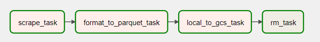
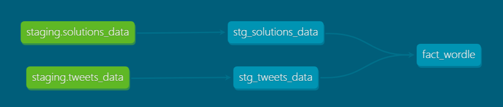

# Wordle ETL Pipeline
[Dashboard](https://datastudio.google.com/reporting/1cdb0ff2-abfb-447d-afea-8d256f4edf54)

A data pipeline modeling New York Time's (NYT) Wordle data from Twitter posts.

The Project serves as an opportunity to develop skills including Python, Airflow, Docker, Spark, DBT, and GCP tools


## Architecture


1. Create GCP Infrastructure with Terraform
2. Extract [Wordle Tweets Data](https://www.kaggle.com/datasets/benhamner/wordle-tweets/download?datasetVersionNumber=361) + scrape [Wordle Solutions Data](https://wordfinder.yourdictionary.com/wordle/answers/) from the web
3. Parquetize data
4. Load raw data to GCS Bucket
5. Transform with Spark using Dataproc
6. Load to Bigquery
7. Model and Stage data with DBT
8. Visualization


## Terraform
Terraform is an infrastructure-as-code tool which allows you to setup and destroy cloud resources using code.

For this project, I am using Google Cloud Platform (GCP) to create:
- A Data Lake for storing raw and transformed data.
- A BigQuery Data Warehouse for external tables, staging, and the final model.


## Airflow
Apache Airflow orchestrates the majority of the Wordle Pipeline excluding the staging layer orchestrated by dbt.

There are 2 ingestion and 1 transformation DAGs in the pipeline.


`tweets_data`, `wordle_solutions`


Ingestion Task Flow:
1. `scrape_task`: Scrapes data from web or local file system as csv
2. `format_to_parquet_task`: Converts raw csv files to parquet for storage efficiency
3. `local_to_gcs_task`: Uploads parquet files to data lake
4. `rm_task`: Removes remaining local files

`tweets_data` is run once because it is a single dataset, but can be scheduled to run in intervals for updated data.

`wordle_solutions` is scheduled to run monthly to scrape each month's NYT Wordle solutions.

`dataproc_dag`


Dataproc Task Flow:
1. `create_cluster`: Creates a Dataproc cluster to run Apache Spark remotely
2. `submit_job`: Submits Spark job to Dataproc for execution
3. `delete_cluster`: Deletes the Dataproc cluster after successful execution of the job


## Docker
Airflow is containerized through Docker.

The `docker-compose.yaml` file defines the services and dependencies necessary for this pipeline:
- Volumes: Connects Docker file system to local file system
- Postgres: Backend for Airflow
- Airflow Webserver: Access to Airflow Web UI
- Airflow Scheduler: Schedule Airflow DAGs
- Airflow Init + CLI: Initializes and runs Airflow

To boot/setup the container run:
```
docker-compose up
```

To shut down the container run:
```
docker-compose down
```

## Spark
The transformations on raw data are made through Apache Spark in a Dataproc Cluster.

The script redefines the schema to be more efficience in size.

The raw tweet is parsed to extract Wordle data including:
- Wordle ID
- Attempt Count
- Representation of Each Attempt as a non-emoji representations
- Number of Correct/Different Location/Incorrect per attempt

Once the data is transformed, the SparkScript outputs the transformed data to the Data Lake.


## dbt
dbt is a transformation tool for modeling data on top of a data warehouse.

Because transformations to the data was already done using Apache Spark, dbt isn't required to make any advanced transformations in this pipeline, but was incorporated for testing purposes.

Beyond using SQL and Jinja to programmatically transform tables in the data warehouse, dbt can be used to build, document, and test models for data integrity though yml files which can define schemas and tests to be run against the data model.


It can also be a great tool to visualize how the data sources, staging tables, and final models are linked together.


## Visualization
Visualization was created through Looker Stuido, formerly Google Data Studio.
The data was initially connected through the BigQuery Data Warehouse, but was later later exported locally in a tabular format in order to prevent further charges from GCP.

[](https://lookerstudio.google.com/reporting/1cdb0ff2-abfb-447d-afea-8d256f4edf54)

[Link to Last.fm ETL Dashboard](https://lookerstudio.google.com/reporting/1cdb0ff2-abfb-447d-afea-8d256f4edf54)